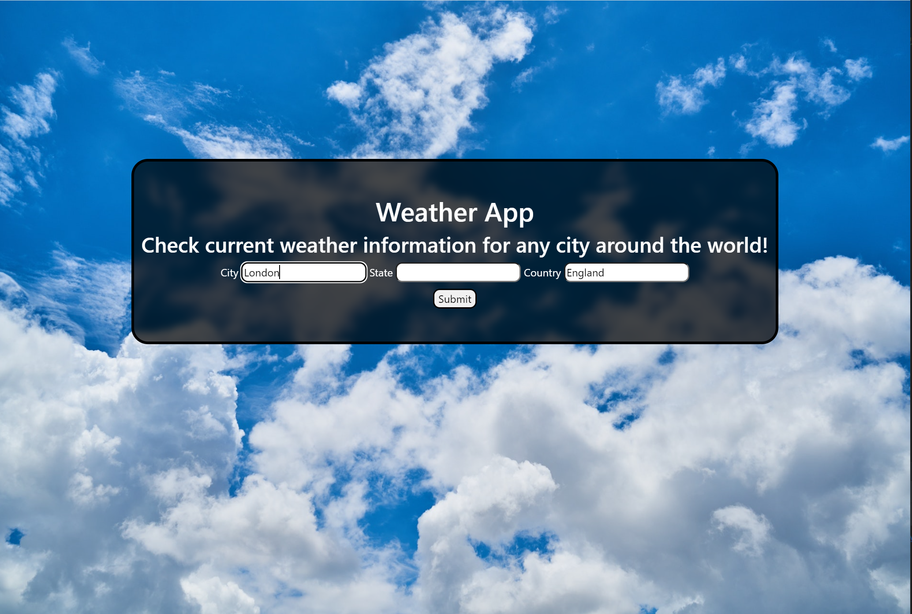
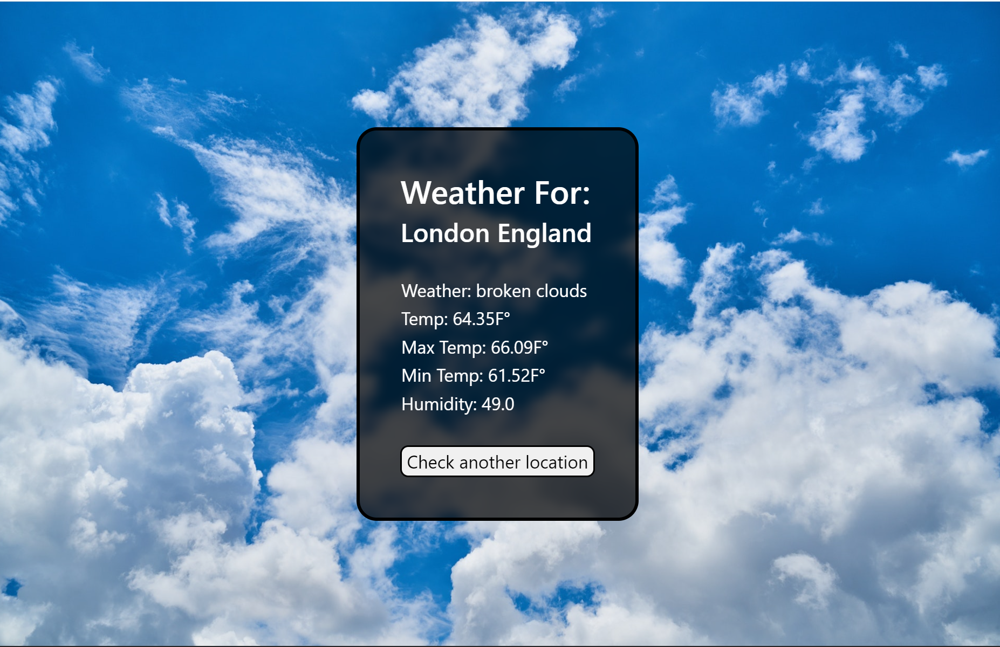

# weather-app-java
Weather web application created using Spring Boot and Thymeleaf.

# APIs used
####    OpenWeatherMap's Current Weather Data API
    https://openweathermap.org/current

####    OpenWeatherMap's GeoCoding API
    https://openweathermap.org/api/geocoding-api

# Instructions
In order to use this web app you need to register at https://openweathermap.org/ for an API key. Then download this project and copy your API Key 
into the LocationService.java and WeatherService.java files. Run the Application and type http://localhost:8080/weather into your favorite browser.
Type in a city and country of your choosing (state is not required) and see important weather information about this location!

## Home Page

## Results Page

